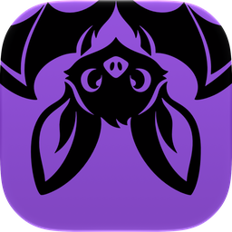
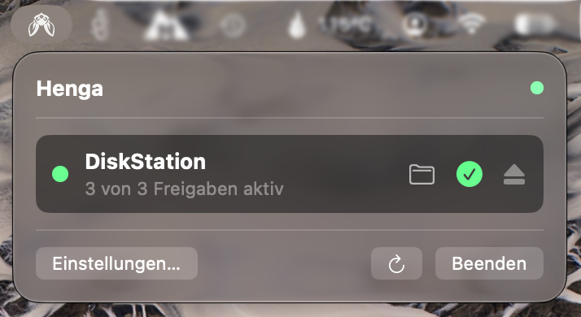
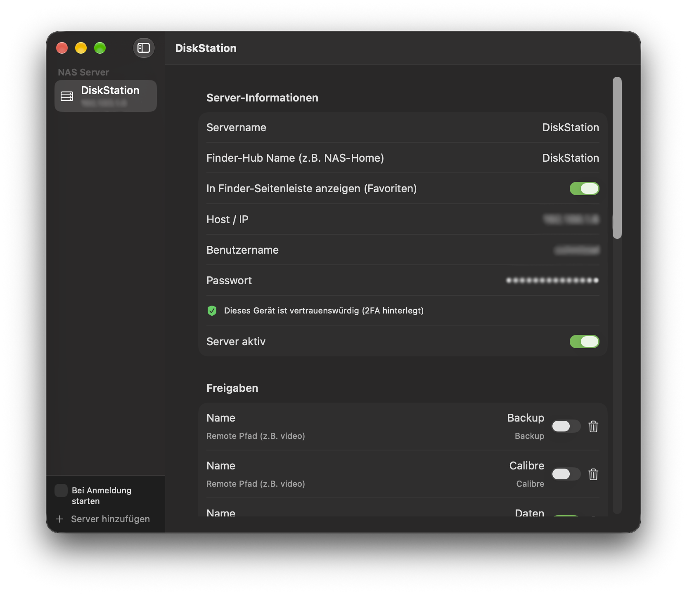

<div align="center">



# Henga

**Native macOS Menu Bar App for robust, zero-hassle NAS mounting.**<br>
*Auto-mount SMB shares without duplicate `/Volumes/share-1` ghost mounts, keychain prompts, or cluttered system views.*

<a href="https://apps.apple.com/app/id6814454906"></a>

[](https://apps.apple.com/app/id6814454906)
[](https://apps.apple.com/app/id6814454906)
[](https://swift.org)
[](LICENSE)
[](https://buymeacoffee.com/pommesbude)



</div>

---

## The Problem Henga Solves

Anyone using a Synology NAS or network storage on macOS knows the daily struggle:
- **Ghost Mounts:** macOS disconnects unreliably on sleep/wake, leaving dead `/Volumes/share-1`, `/Volumes/share-2` folders.
- **Cluttered "Computer" Overview:** macOS floods your `MacBook Air` system view with dozens of network drive icons.
- **Keychain Prompt Cascades:** System dialogs constantly ask for passwords after reboot.
- **Finder Lag:** Stale SMB sessions beachball Finder when the NAS is unreachable.

**Henga fixes this at the kernel level.**

---

## Key Features

- 🚀 **Zero Ghost Mounts (`-o nobrowse`):** Mounts network drives with the kernel `MNT_NOBROWSE` flag. Your macOS "Computer" view remains 100% clean and uncluttered.
- 📁 **Central Finder Hub (`~/DiskStation`):** All active shares are neatly linked into your designated Finder hub folder (just like ShellFish or iCloud Drive).
- 🔐 **Synology DSM 7 2FA Support:** Native FileStation WebAPI discovery with trusted device token persistence (`did`). Enter your 2FA OTP code once; never get prompted again.
- 🔄 **Smart Auto-Mount & Reconnect:** Automatically monitors reachability (POSIX non-blocking socket checks) and transparently reconnects shares when network returns.
- ⚡ **Launch at Login:** Zero-hassle autostart using Apple's modern `SMAppService.mainApp` API.
- 🌐 **Multi-NAS Architecture:** Configure multiple Synology DiskStations or universal SMB servers with custom hub names and independent mount controls.

---

## Architecture & Code Quality

Henga is built strictly following native Swift 6 and macOS platform guidelines:

```
Henga
├── HengaCore            # Pure Swift logic, SMB mount engine, 2FA API client, Keychain helper
├── HengaMac             # Native SwiftUI macOS Menu Bar Extra & Settings UI
└── HengaCLI             # Headless diagnostic tool for automation & server testing
```

- **Local Quality Gate:** Strict offline validation of the macOS/Swift 6 architecture before every commit.
- **Adversarial Sabotage Tests:** Tested against path injection attacks, malformed DSM 7 JWT error responses, and corrupt mount outputs.

---

## Installation

**Mac App Store (recommended):** [Download Henga for free](https://apps.apple.com/app/id6814454906) — requires macOS 14 Sonoma or later.

After installing, click the Henga icon in your menu bar and open **Settings** to add your NAS.

<div align="center">

</div>

---

## Build from Source

1. **Clone the repository:**
   ```bash
   git clone https://github.com/hehljo/Henga.git
   cd Henga
   ```
2. **Open the Xcode Workspace:**
   ```bash
   open Henga.xcworkspace
   ```
3. **Build & Run:**
   - Select scheme **`HengaMac`**
   - Press **Cmd + R**

---

## Support & Donation

If Henga saves you time and keeps your macOS Finder uncluttered, consider supporting the development:

<div align="center">

[](https://buymeacoffee.com/pommesbude)

</div>

---

## License

MIT License. See [LICENSE](LICENSE) for details.
